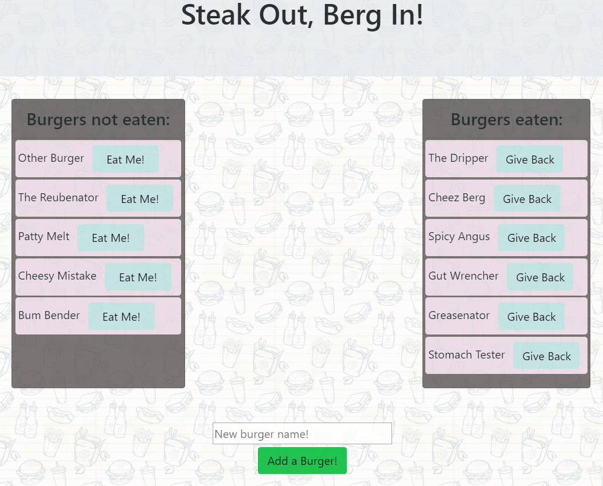

# **Purpose**

The purpose of this activity is to interact with a sql database utilizing handlebars and ORM structuring. The main functionality with the communication with the database is `POST` and `PUT`. 

The user selects which burger they want to eat, or give back, and it will update the database accordingly and refresh the page with the burgers in the corresponding spots under "Burgers Eaten" and "Burgers not Eaten".

# **Brief Explanations**

### **orm.js**

* `sqlEyesObj()` Takes the object given to it through an ajax call, and puts the values of each key in the object in a string, and then pushes it to an array with the value's key so that it is structured like this: `'key = value'`. This makes it readable for SQL for proper communication to the database and functionality.

* `orm{}` is an object of methods that is exported for use in `/models/burger.js`.
  * `selectAll()` selects all from `burgers_db.burgers` for initializing the page. This method is used on the page load, as dictated by `burger_controller.js` and gives the information for all the burgers stored in `burgers_db`.
  * `insertOne()` creates a new entry for the `burgers` table. It takes in the table, column, value, and a call back function. The query string is set using table, cols, vals, `toString()` and logical operators to pass as an argument for the `connection.query()` function. The call back function is used for the response, and is inherited from what is specified in `burger_controller.js`.
  * `updateOne()` works in a very similar way to `insertOne()` for setting the query string. Here, an object is used, and `sqlEyesObj()` is called to make it readable for the database. This method updates the devoured status of the burger.

* `orm{}` is exported at the end of this file to be imported for use in `/models/burger.js`.

### **models/burger.js**

`orm.js` is required in this file. All of the methods set in `orm{}` are set here, and the required arguments used in the `burger{}` methods since one of the arguments is set when `orm{}`'s methods are called in `burger{}`'s methods. This makes it easier for the front end and back end to communicate since the front end doesn't have to put in as many arguments to send to the back end for database communication. The methods are renamed in `burger{}`, for easier use.

### **burger_controller.js**

Works as a router for the server. It takes the url parameters specified by the initial page load, or the url parameters specified by the ajax calls. `burger_controller.js` requires `/models/burger.js`, and uses the methods as specified by `/models/burger.js` that are also imported from `orm.js` to `/models/burger.js`.

* `router.get()` fires off on the page load with the base url. It executes `burger.all()` and gives the data on all of the burgers stored in `burgers_db.burgers` to the handlebars files. 

* `router.post()` takes the object data from the ajax call in `js/burgers.js` and creates a new burger with it's specifications.

*  `router.put()` updates the selected burger's devoured status. The data for the burger to be updated, and what to update it to, is given by the ajax call that is pulled from the `data-` attributes set by handlebars.

### **public/assets/js/burgers.js**

Holds the ajax calls for updating and creating burgers. The data is set on the button click and is passed as an object to be readable with `orm.js`'s communication with sql through it's methods.

This also sets all of the data for the burgers that are stored in the `data-` attributes in the html.

### **index.handlebars**

Receives all of the information about the burgers on the page load due to `router.get()` in `burger_controller.js`. `{{#each}}` is used to list all of the burgers; `{{#unless}}` and `{{#if}}` is used to filter the burgers according to their devoured status. Two cards are used to display the burgers eaten, and the burger not eaten. 

If the burgers aren't devoured, then a button is placed next to the `{{burger_name}}` prompting the user to eat the burger, the button holds the burger's id and the opposite value of it's devoured status for update. If the burger is eaten, the user is prompted to give the burger back.

# **Demo**

